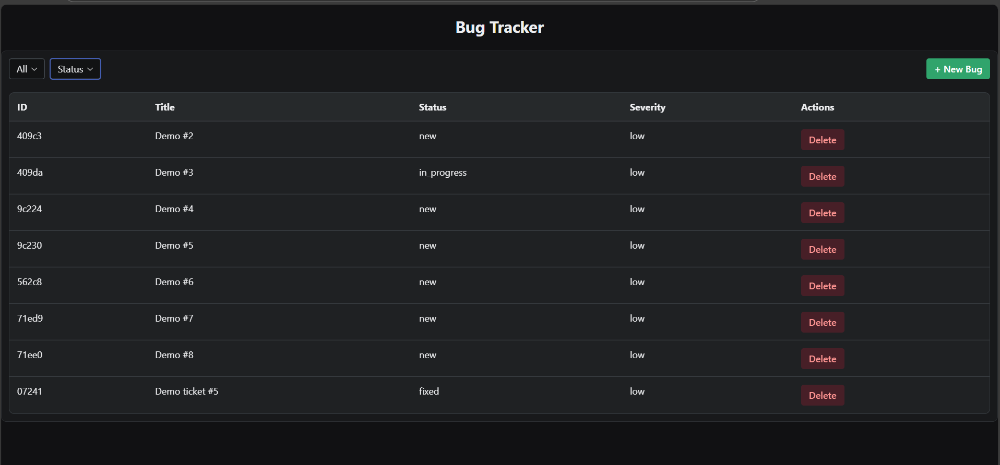
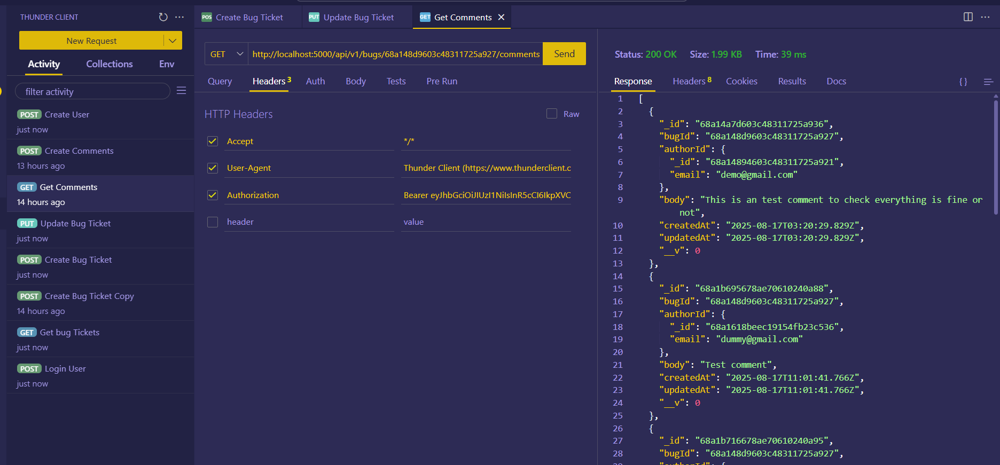

# Bug Tracker Project

A full-stack **MERN Bug Tracker** application.

---

## How to Run

### Clone the repository

```bash
git clone https://github.com/AthulKkumar/bug-tracker
cd <Into the cloned directory>
```

### Install dependencies

```bash
# Install root dependencies
npm install-all

# To run both frontend and backend
npm run start

# Or install separately

# Frontend
cd client
npm install

# Backend
cd server
npm install
```

### Run project concurrently

From the root directory:

```bash
npm run start
```

- **Frontend:** http://localhost:3000
- **Backend:** http://localhost:5000

## Environment Variables

### Client side env
```env
BUILD_PATH=../server/public
```

Create a `.env` file in `server/`:

```env
PORT=5000
MONGO_URI=mongodb://localhost:27017/bugtracker
JWT_SECRET=your_jwt_secret
ALLOWED_ORIGINS=http://localhost:3000,https://your-deployed-frontend.com
```

## Database Schema

### User
```json
{
  "email": "string",
  "password": "string",
}
```

### Bug
```json
{
  "title": "string",
  "description": "string",
  "severity": "low | medium | high",
  "status": "open | in_progress | fixed | closed",
  "assigneeId": "User._id",
  "createdAt": "Date",
  "updatedAt": "Date"
}
```

### Comment
```json
{
  "body": "string",
  "authorId": "User._id",
  "bugId": "Bug._id",
  "createdAt": "Date",
  "updatedAt": "Date"
}
```

## API List

| Method | Route | Description |
|--------|-------|-------------|
| POST | `/api/v1/user/register` | Register a new user |
| POST | `/api/v1/user/login` | Login user and return JWT |
| GET | `/api/v1/bugs` | Get all bugs (severity and status optional filters) |
| POST | `/api/v1/bugs` | Create a new bug |
| GET | `/api/v1/bugs/:id` | Get a bug by ID |
| PUT | `/api/v1/bugs/:id` | Update a bug by ID |
| DELETE | `/api/v1/bugs/:id` | Delete a bug by ID |
| GET | `/api/v1/bugs/:bugId/comments` | List comments for a bug |
| POST | `/api/v1/bugs/:bugId/comments` | Add a comment to a bug |

> **Note:** Protected routes require JWT token in Authorization header.

## Live URL

You can access the live demo of the Bug Tracker application at: 

Deployed on Render.com

[Live Demo](https://bug-tracker-due7.onrender.com)

## UI Images





## Backend API Test Images

### Thunder Client Testing





